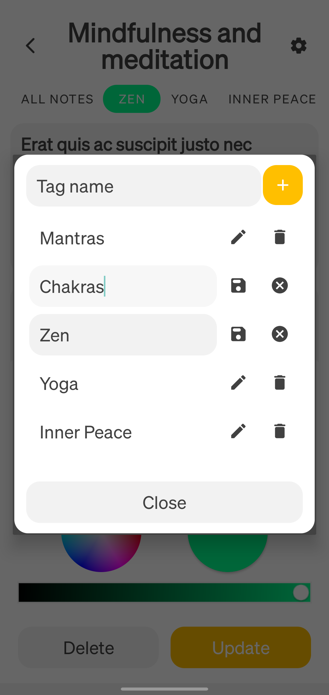

# 📝 Notelo

This is the second Android app I've made, and the first one that uses the Kotlin programming language.
It follows the MVVM Single-Activity and Clean architecture.

Notelo is a note-taking app that helps you stay organized by allowing you to create and categorize
notes in a way that makes sense to you. With Notelo you can create notes, put them in categories and
group them by tags, making it easy to manage and find the notes you need.

|                                                  |                                                       |                                             |
|--------------------------------------------------|-------------------------------------------------------|---------------------------------------------|
|  |  |  |

## ✨ Features

- Create notes, categories and category tags
- Organize notes into categories for easy browsing
- Group notes by category tags for quick filtering
- Manage notes, categories and tags locally and remotely
- Search through personal notes
- Make personal notes available to other users
- Sync personal notes across devices by logging into your account
- Explore the public notes of other users or news articles
- Add public notes and articles to the personal collection
- Customize the app with themes and settings

## 🔮 Technologies

- **Kotlin** for the app logic
- **Room** for persistent data
- **Firebase** as the backend
- **ViewModel**s to manage the UI's data in a lifecycle-aware fashion
- **LiveData** to observe data in a lifecycle-aware fashion
- **Kotlin Coroutines** for asynchronous tasks
- **Kotlin Flows** to handle streams of data asynchronously
- **WorkManager** to schedule data synchronization work
- **Koin** for dependency injection
- **Navigation Component** to allow users to navigate across, into, and back out from the different pieces of content within the app
- **Safe Args** to attach data to a navigation operation by defining arguments for a destination
- **Kotlin Parcelize** as a `Parcelable` implementation generator
- **Retrofit** for the API calls
- **Glide** for the image loading
- **View Binding** to generate a binding class for each XML layout file
- Other nice things

## 🏗️ Architecture

This is a **Single-Activity** app built on top of the **Model-View-ViewModel** (MVVM) architecture
that follows the principles of **Clean Architecture** for maintainability and scalability.

## 👀 Preview

| Sign in                                        | Sign up                                        | Password reset                                         |
|------------------------------------------------|------------------------------------------------|--------------------------------------------------------|
|  |  |  |

| Personal notes                                   | Personal notes search results                                                                                                                                         | Personal categories                                   |
|--------------------------------------------------|-----------------------------------------------------------------------------------------------------------------------------------------------------------------------|-------------------------------------------------------|
|  |  

No results

 |  |

| Personal note viewer                                                                                                                                                                                                                         | Note properties                                                                                                                                                                                                                                                                               |
|----------------------------------------------------------------------------------------------------------------------------------------------------------------------------------------------------------------------------------------------|-----------------------------------------------------------------------------------------------------------------------------------------------------------------------------------------------------------------------------------------------------------------------------------------------|
|  

Note edit

 

Note creation

 |  

Category selection

 

Category tags selection

 |

| Category viewer                                  | Category properties                                    | Category tags management                                    |
|--------------------------------------------------|--------------------------------------------------------|-------------------------------------------------------------|
|  |  |  |

| Discover articles and notes                                                                                                                        | Article viewer                                  | Settings                                    |
|----------------------------------------------------------------------------------------------------------------------------------------------------|-------------------------------------------------|---------------------------------------------|
|  

Search results

 |  |  |

## 🚀 Getting started

To get started with Notelo, follow these steps:

1. Clone this repository to your local machine
2. Import the project into Android Studio
3. Build and run the app on an emulator or physical device

## 🤝 Contributing

Contributions to Notelo are always welcome! If you find a bug, have an idea for a new feature, or
want to improve the app in any way, feel free to open an issue or submit a pull request.